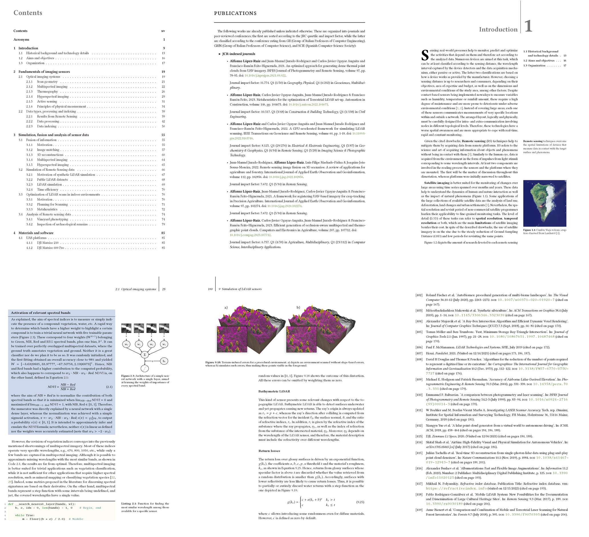

# PhD-Dissertation :octocat: :rocket: :tada:
LaTeX repository of the PhD disseration titled 'New tools for the modelling of sensor data', presented at the University of Jaén in May, 2023.

This template is simply a fork of _kaobook_, which can be found in [Github](https://github.com/fmarotta/kaobook).

## Preview

Some of the pages of this modified template are following illustrated, and the PhD dissertation document can be found in [Drive](https://drive.google.com/file/d/1gsEIOEqNZrPierTbDLcsJhb3JlUux23y/view?usp=sharing).

